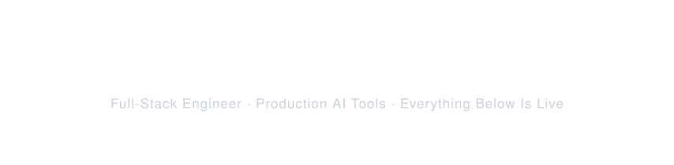

**Self-taught full-stack engineer building production AI tools.**
Every project below is deployed and live — click anything.

[Portfolio](https://yousof.dev) · [LinkedIn](https://www.linkedin.com/in/yousof-mohamed-dev) · [gumballchief@gmail.com](mailto:gumballchief@gmail.com)

---

## Slovey — organizational memory for engineering teams

**Live at [slovey.dev](https://slovey.dev)**
Next.js · TypeScript · Supabase (PostgreSQL + Auth) · Drizzle ORM · pg-boss · Stripe · Render

Slovey captures a team's decisions, constraints, and postmortems, then runs a **preflight gate**: before anyone — human or AI agent — starts a task, it checks the plan against everything the team already decided and flags conflicts *before* the code ships.

What's real today:

- Multi-tenant SaaS: hosted token-authenticated API, dashboard, background worker, and an npm-installable CLI that outside teams can run against their own repos
- An autonomous PR agent that plans changes, writes code through the preflight gate, opens a draft pull request, and self-reviews until clean
- Stripe billing with usage metering and plan-limit enforcement
- Load-tested at 100 concurrent users; a structured pre-launch audit found 20 bugs, and the critical ones were fixed and shipped

Honest status: launched July 2026 — no external users yet.

---

## Also live

| Project | What it is | Notes |
|---|---|---|
| [**CSLiquid**](https://csliquid.xyz) | Perpetual futures DEX for CS2 skins on Solana — 35 live markets with real-time Steam price oracles | [Public repo](https://github.com/gumballchief/csliquid) |
| [**Gold Protocol**](https://gldfi.net) | Token on Robinhood Chain that pays holders in PAXG (tokenized gold) | 25-test Solidity suite; airdrop tool proven on mainnet |
| [**snoofi**](https://snoofi.fun) | Scroll-driven 3D landing page — Three.js + GSAP ScrollTrigger | Live |
| [**Lucky Coin**](https://luckycoin.fun) | Scratch-ticket-themed memecoin landing page | Live |
| [**yousof.dev**](https://yousof.dev) | Portfolio with a live status board for everything above | Live |

---

## Stack

TypeScript · Next.js · React · Node.js · PostgreSQL · Supabase · Solidity · Solana (Anchor) · Three.js · Tailwind — deployed on Render and Vercel.

---

## Contact

Open to full-stack and backend engineering roles.

**gumballchief@gmail.com** · [yousof.dev](https://yousof.dev) · [LinkedIn](https://www.linkedin.com/in/yousof-mohamed-dev)
